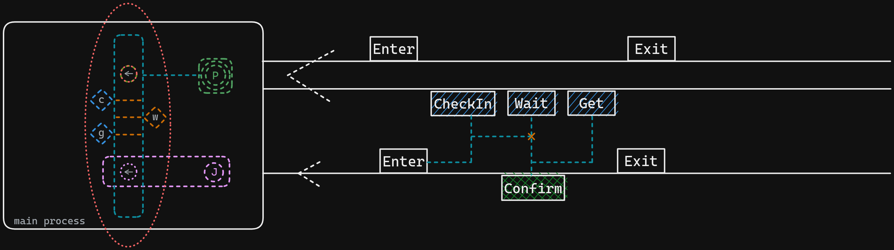
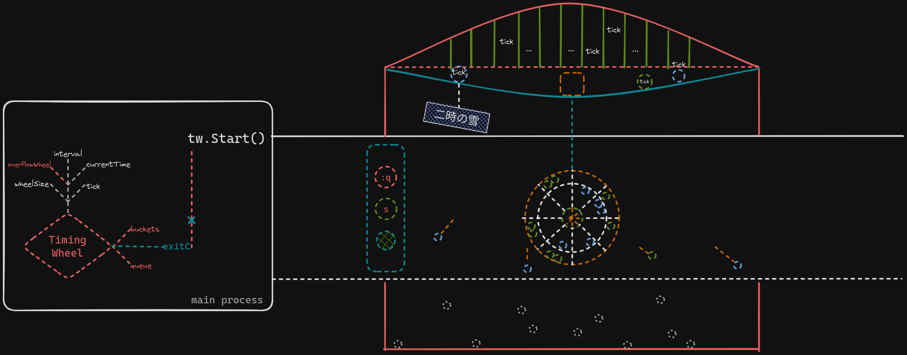
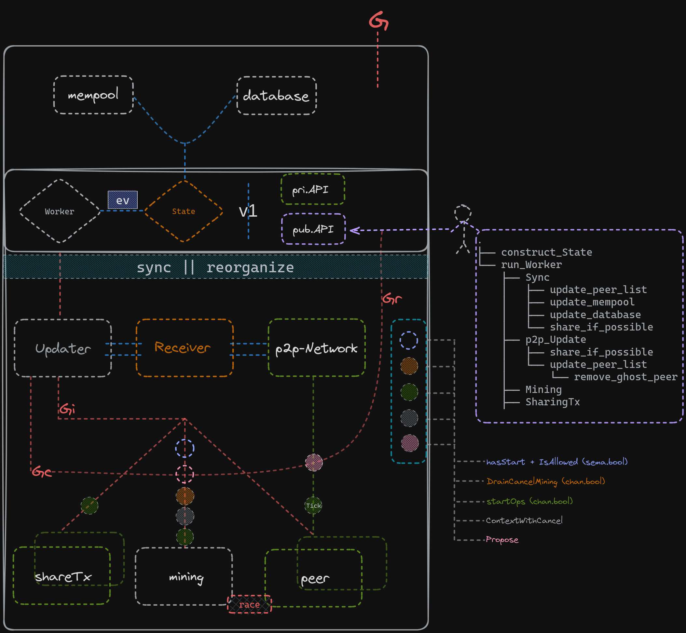

# To-the-Fullest-Extent

> The problem statement reads as follows:

"There are three kinds of threads: immigrants, spectators, and a one judge. Immigrants must wait in line, check in, and then sit down. At some point, the judge enters the building. When the judge is in the building, no one may enter, and the immigrants may not leave. Spectators may leave. Once all immigrants check in, the judge can confirm the naturalization. After the confirmation, the immigrants pick up their certificates of U.S. Citizenship. The judge leaves at some point after the confirmation. Spectators may now enter as before. After immigrants get their certificates, they may leave."

> before we get started:

Go creates the illusion for concurrency that all `Treads` that can execute are executing at the same time. 

However, *concurrency* means out of order execution. In the finer level of granularity, CSP enables us to write code in sequence so that our program can scale dynamically when it runs to the amount of parallelism possible.

This makes writing concurrent codes simpler as we can `coordinate the input from multiple subsystems` by easily composing the output together. 

Besides, you can combine input channels with timeouts, cancellations, or messages to other subsystems. 

In Go, _share memory by communicating_. 

> let's get hands dirty

 In coarse-grained level, there are 3 kinds of threads happening at the same time, therefore we can't identify who comes first and what action would be triggered at the specific statement.

 With the help of CSP, we could record states for each person, and then coordinate them using channels with cancellation, or messages to other person.

- This is what we can see in Figure 1.1, 
	- Immigrants can enter, check in, wait in line, get confirmation, then leave
	- Judge can enter, confirm, then leave
	- there is a synchronization constraint(`w`), 
		- semaphore in orange color for enforcing event to wait
		- once all immigrants check in, Judge will be signalled to confirm
	- other limits can be done with channel:
		- immigrants cannot leave until Judge has left
		- spectators can enter as log as the judge is not in the court
		- ...


```go
func (i *Immigrant) Run(c *Court) {
	c.Enter(i)
	c.CheckInImmigrant(i)
	c.AwaitConfirmation(i)
	c.GetCertificate(i)
	c.LeaveImmigrant(i)
}
```
> timewheel



> orchestration in blockchain


